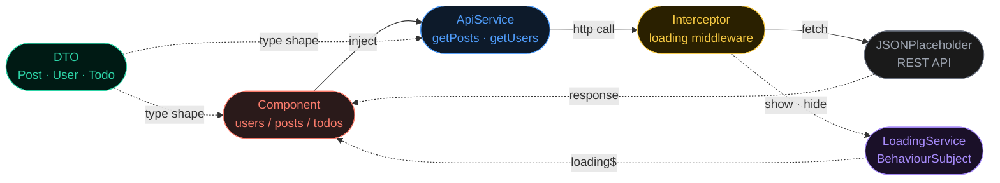

<div align="center">

# Plaza App

**A complete Angular 19 learning project — built with industry-standard architecture**


*Every file in this project exists to teach a specific concept.*
*By the time you understand all of it — you understand how real Angular apps are built.*

</div>

---

## Architecture

Every HTTP request flows through this exact pipeline.



> **Solid arrows** = direct calls · **Dashed arrows** = data / type flow

---

## Project Structure

```
src/
├── app/
│   ├── models/                    # DTOs — data shape definitions
│   │   ├── post.model.ts
│   │   ├── user.model.ts
│   │   └── todo.model.ts
│   │
│   ├── services/                  # Business logic layer
│   │   ├── api.ts                 # all HTTP calls live here
│   │   └── loading.ts             # global loading state
│   │
│   ├── interceptors/              # HTTP middleware
│   │   └── loading-interceptor.ts
│   │
│   ├── users/                     # Feature components
│   ├── posts/
│   ├── todos/
│   │
│   ├── app.ts                     # Root component
│   ├── app.routes.ts              # Route definitions
│   └── app.config.ts              # App-wide providers
```

---

## Core Concepts

### 01 — DTO (Data Transfer Object)

A TypeScript interface that describes the **exact shape** of API data. It is a contract — break it and TypeScript tells you immediately.

**Why not just use `any`?**

```typescript
// bad — TypeScript can't help you
const post: any = response;
post.titel;  // typo — no error, silent bug at runtime

// good — TypeScript catches it immediately
const post: Post = response;
post.titel;  // Error: Property 'titel' does not exist on type 'Post'
```

```typescript
// src/app/models/post.model.ts
export interface Post {
  userId: number;
  id:     number;
  title:  string;
  body:   string;
}
```

> **Rule:** Only map fields your app actually uses. Unused fields are noise — this is the **YAGNI** principle.

---

### 02 — Service

An injectable **singleton** that centralises all HTTP calls. Every component that needs data asks the service — none of them talk to the API directly.

```typescript
// src/app/services/api.ts
@Injectable({ providedIn: 'root' })
export class ApiService {
  private readonly baseUrl = 'https://jsonplaceholder.typicode.com';
  private http = inject(HttpClient);

  getPosts()  { return this.http.get<Post[]>(`${this.baseUrl}/posts`); }
  getUsers()  { return this.http.get<User[]>(`${this.baseUrl}/users`); }
  getTodos()  { return this.http.get<Todo[]>(`${this.baseUrl}/todos`); }
}
```

> `providedIn: 'root'` creates **one instance** shared across the entire app — that is the **Singleton pattern**.

---

### 03 — BehaviourSubject

A reactive value from RxJS. Holds a current state and **instantly notifies** every subscriber when it changes — without any component manually passing values around.

```typescript
// src/app/services/loading.ts
export class LoadingService {
  private loadingSubject = new BehaviorSubject<boolean>(false);
  loading$ = this.loadingSubject.asObservable();  // $ = it's an Observable

  show() { this.loadingSubject.next(true);  }
  hide() { this.loadingSubject.next(false); }
}
```

> Think of it like a **TV broadcast** — one update, unlimited watchers, all notified instantly.

---

### 04 — Interceptor

Middleware that runs **automatically on every HTTP request and response**. Components never know it exists. Write it once — works for every API call in the app forever.

```typescript
// src/app/interceptors/loading-interceptor.ts
export const loadingInterceptor: HttpInterceptorFn = (req, next) => {
  const loadingService = inject(LoadingService);
  loadingService.show();

  return next(req).pipe(
    tap({
      next:  () => loadingService.hide(),
      error: () => loadingService.hide()  // always hide, even on failure
    })
  );
};
```

> `tap()` is the **nosy neighbour** — it peeks at the response without changing it.

---

### 05 — Component

Three files working as **one unit**. Angular 19 uses standalone components with modern `@for` control flow syntax.

```
users.ts      the brain   — logic, injections, data
users.html    the face    — what the user sees
users.scss    the clothes — styles scoped to this component only
```

```typescript
// users.ts
export class Users {
  private apiService = inject(ApiService);
  users$ = this.apiService.getUsers();   // Observable — not raw data yet
}
```

```html
<!-- users.html -->
@for (user of users$ | async; track user.id) {
  <li>{{ user.name }}</li>
}
```

> The `async` pipe subscribes, unwraps data, and **auto-unsubscribes** when the component is destroyed. No memory leaks.

---

### 06 — Routing

Each feature lives at its own URL. `routerLink` navigates without a full page reload — that is what makes this a **Single Page Application (SPA)**.

```typescript
// app.routes.ts
export const routes: Routes = [
  { path: 'users', component: Users },
  { path: 'posts', component: Posts },
  { path: 'todos', component: Todos },
  { path: '',      redirectTo: 'users', pathMatch: 'full' }
];
```

> `routerLink` vs `href` — `href` triggers a full page reload and destroys all app state. `routerLink` navigates instantly with no reload.

---

## Naming Conventions

| Type | Convention | Example |
|---|---|---|
| Files | kebab-case | `user-profile.ts` |
| Classes | PascalCase | `UserProfileComponent` |
| Selectors | app-kebab-case | `app-user-profile` |
| Methods | camelCase, verb first | `getUsers()` |
| Observables | camelCase + `$` suffix | `users$`, `loading$` |
| Interfaces | PascalCase, singular | `Post`, `User`, `Todo` |

---

## Engineering Principles

| Principle | Applied Where |
|---|---|
| **Single Responsibility** | `ApiService` handles HTTP only. `LoadingService` handles state only. |
| **DRY** — Don't Repeat Yourself | All HTTP logic lives in one service, not repeated across components. |
| **YAGNI** — You Ain't Gonna Need It | Only mapped API fields the app actually uses. |
| **Separation of Concerns** | Logic in `.ts`, structure in `.html`, styles in `.scss`. |

---

## Running the Project

```bash
# install dependencies
npm install

# start development server
ng serve
```

Open `http://localhost:4200`

| Route | Component | Records |
|---|---|---|
| `/users` | UsersComponent | 10 users |
| `/posts` | PostsComponent | 100 posts |
| `/todos` | TodosComponent | 200 todos |

---

## API

All data from [JSONPlaceholder](https://jsonplaceholder.typicode.com) — a free fake REST API. No auth, no setup.

```
GET /users      GET /users/1
GET /posts      GET /posts/1
GET /todos      GET /todos/1
```

---

<div align="center">

*Built as a learning project. Every architectural decision is intentional and follows Angular industry standards.*

</div>